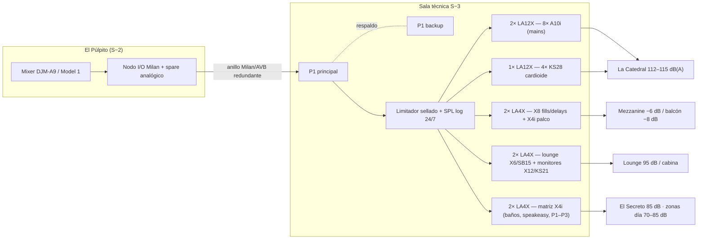

# 04 · Sonido — Diseño Electroacústico

Proyecto C-4 · Cuesta de Cayma N°4, Cayma, Arequipa

---

Referencia de diseño: **estándar Hï Ibiza** — un solo fabricante (L-Acoustics) de cabina a zona, presión homogénea sin puntos calientes, graves cardioides que van al público y no a los muros, y un piso de ruido tan bajo que el sistema puede sonar fuerte sin sonar agresivo. El sistema se dimensiona para **112–115 dB(A) continuos en pista con ≥ 10 dB de headroom de cresta**, dentro de la envolvente acústica del capítulo 03 y bajo limitador sellado.

## 4.1 La Catedral (S−3) — sistema principal

**Geometría:** pista de 86 m² (≈ 6.2 × 14 m, zona `s3-pista`) bajo el vacío de ~9.6 m; cabina "El Púlpito" en voladizo a −7.0 m sobre el borde sur de la pista; muro LED de 6.0 × 6.5 m detrás.

### Sistema colgado

- **4 cuelgues de L-Acoustics A10i (2 cajas por punto — 8× A10i total)**, suspendidos en el vacío a ~+7.5 m sobre la pista (cota ≈ −3.0 m), en planta cuadrada sobre los cuartos de la pista. Combinación A10i Focus (caja superior, tiro largo) + A10i Wide (caja inferior, cobertura cercana): cobertura solapada al 50 % que entrega **±1.5 dB de homogeneidad** en toda la pista y bordes del mezzanine.
- Con SPL máx. de 144 dB por caja y tiros de 6–9 m, cada punto aporta > 126 dB a piso: los cuatro cuelgues suman el objetivo de 115 dB(A) con reserva amplia, trabajando lejos del límite (distorsión y fatiga mínimas).
- Rigging desde subestructura propia con aisladores en los puntos de cuelgue (continuidad del box-in-box, cap. 03).

### Graves — arco cardioide

- **4× KS28 en arco cardioide bajo El Púlpito**, sobre la losa flotante, en bancada de inercia con tacos elastoméricos: 2 cajas frontales + 2 invertidas con retardo (configuración cardioide procesada en LA12X).
- Resultado: **≥ 15 dB de rechazo trasero en 40–80 Hz** — el arco no excita el muro LED, el backstage ni el lindero posterior; la energía de graves va a la pista, no a la estructura. Contorno de graves +6 a +8 dB sobre el sistema colgado (curva de club, estilo Ibiza), alineado en fase en el centro de pista.

### Fills y delays

| Zona | Cajas | Función |
|---|---|---|
| Barra principal / bajo mezzanine (`s3-barra`) | 2× X8 | Delay fills alineados: pedir un trago sin perder el beat ni gritar |
| Baños S−3 (`s3-banos`) | 2× X4i | Programa propio a bajo nivel |
| Balcón al vacío S−1 (`s1-balcon`) | 2× X8 | Delay del balcón: pista a −8/−10 dB, coherente en tiempo — zona de conversación con el show presente |

## 4.2 Mezzanine VIP (S−2) — fuerte pero conversable

- **4× X8 dedicados en la Galería Oeste** (`s2-boxes-oeste`), uno por box, operados a **−6 dB respecto de pista**: el cliente de box vive el show y cierra negocios sin gritar.
- **Palco Frontal** (`s2-boxes-frente`): cobertura directa del sistema principal (está frente a los cuelgues) + 2× X4i de proximidad para relleno de fascia.
- Nivel y ecualización por box desde la matriz (un box puede "bajarse" 3 dB más a pedido del host).

## 4.3 Cabina DJ — El Púlpito (monitoreo)

- **2× X12 + 1× KS21** en configuración estéreo con sub central, sobre soportes aislados de la losa del voladizo: monitoreo a nivel de pista sin excitar la estructura en voladizo.
- Preset de cabina propio en P1: los monitores se atenúan automáticamente 4 dB cuando el micrófono de medición de cabina supera el umbral de exposición del turno (protección auditiva del residente).

## 4.4 Lounge S−1, El Secreto y zonas secundarias

| Recinto | Sistema | Programa |
|---|---|---|
| Lounge — Antesala (`s1-lounge`) | **6× X6 + 2× SB15** distribuidos en cielo/repisas | Programa propio (house/afro) a 95 dB(A) máx, independiente de la pista |
| El Secreto (`s1-speakeasy`) | **2× X4i + 1× SB10i** (sub compacto oculto en la barra) | Vinilo y vivo íntimo, **85 dB(A) máx** (limitado por preset), voicing cálido |
| Baños S−2 / S−1, esclusas y circulaciones | **8× X4i** distribuidos | Programa propio a bajo nivel; la esclusa permanece en silencio deliberado |
| Café P1 (`p1-cafe`) | 4× X4i | Ambiente día 70 dB máx; preset noche apagado hacia fachada |
| Restaurante P2 (`p2-comedor`) | 8× X4i + 2× SB6i | Presets día/noche 70 → 85 dB(A) (day-to-night a las 23:00) |
| Cava-barra P2 (`p2-cava`) | 2× X4i | Zona propia |
| Salones P3 (`p3-salones`) | 4× X4i + sistema de conferencia (micros inalámbricos + DSP con AEC) | Presentación / cóctel / fiesta privada |
| Private dining P3 | 2× X4i | Discreto |
| Terraza azotea | **Sin sistema** | Compromiso acústico: cero música exterior |

Se adopta ecosistema de baja impedancia X4i (16 Ω, hasta 4 cajas por canal de LA4X) en lugar de línea de 100 V: misma firma sonora del club en todo el edificio y procesamiento por zona desde la misma matriz.

## 4.5 Amplificación, procesamiento y red

Toda la amplificación vive en la **sala técnica S−3** (`s3-backstage`, racks ventilados con extracción propia silenciada):

| Rack | Equipos | Carga |
|---|---|---|
| RK-1 Mains | 2× LA12X | 8× A10i (1 caja/canal, potencia plena) |
| RK-2 Subs | 1× LA12X | 4× KS28 (1/canal, procesado cardioide) |
| RK-3 Fills club | 2× LA4X | 6× X8 (fills + delays) + 2× X4i palco |
| RK-4 Lounge/monitores | 2× LA4X | 6× X6 + 2× SB15 · 2× X12 + KS21 |
| RK-5 Distribuido | 2× LA4X | ~30× X4i + SB10i + SB6i por zonas |
| Procesamiento | 2× P1 (principal + respaldo en standby caliente) + kit de calibración M1 | Matriz, EQ, delays, limitación |
| Red | 2× switches AVB (anillo redundante) | **Milan/AVB** con respaldo analógico |
| Energía | UPS on-line 6 kVA (procesos y red) + acondicionador | Tierra técnica aislada |

- **Red Milan/AVB redundante** (anillo cabina → sala técnica → zonas): audio, control y monitoreo por la misma red determinista; caída de un enlace no interrumpe el show. Respaldo analógico directo cabina → LA12X de mains.
- **Calibración M1**: alineamiento de fase mains/subs/fills, targets por zona, verificación estacional documentada.
- **Medición SPL continua + limitador sellado** sobre los buses maestros del P1 (cap. 03 §3.6): pista limitada a 115 dB(A), lounge 95, speakeasy 85, día 70/85. Registro LAeq/LCeq por minuto, 24/7.
- Consumo eléctrico del sistema completo a programa musical (≈ 1/8 de potencia): **~12 kW**; alimentador dedicado con supresor y secuenciador de encendido.

## 4.6 Diagrama lógico de señal

## 4.7 Tabla maestra de equipos

| Zona | Equipo | Cant. | Cobertura / rol | SPL objetivo zona |
|---|---|---|---|---|
| La Catedral | L-Acoustics A10i (Focus+Wide) | 8 | 4 cuelgues × 2, pista 86 m² | 112–115 dB(A) |
| La Catedral | KS28 (arco cardioide) | 4 | Graves 25–100 Hz, rechazo trasero ≥ 15 dB | +6/+8 dB contorno |
| Barra S−3 | X8 (delay fill) | 2 | Bajo mezzanine | 105 dB(A) |
| Balcón S−1 | X8 (delay) | 2 | Galería al vacío | −8/−10 dB vs. pista |
| Mezzanine oeste | X8 | 4 | 1 por box, −6 dB | 106–109 dB(A) |
| Palco frontal S−2 | X4i (fill) | 2 | Proximidad fascia | directa + fill |
| Cabina | X12 + KS21 | 2 + 1 | Monitoreo DJ | a demanda, protegido |
| Lounge S−1 | X6 + SB15 | 6 + 2 | Programa propio | 95 dB(A) máx |
| El Secreto | X4i + SB10i | 2 + 1 | Vinilo/vivo íntimo | 85 dB(A) máx |
| Baños/circulaciones (S−3/S−2/S−1) | X4i | 8 | Distribuido | ≤ 80 dB(A) |
| Café P1 | X4i | 4 | Ambiente | 70 dB(A) |
| Restaurante P2 | X4i + SB6i | 8 + 2 | Day-to-night | 70→85 dB(A) |
| Cava P2 · Salones P3 · Private P3 | X4i | 2 + 4 + 2 | Zonas propias | 70–85 dB(A) |
| Amplificación | LA12X / LA4X | 3 / 8 | Sala técnica S−3 | — |
| Procesamiento | P1 (+backup) / M1 | 2 / 1 | Matriz + calibración | — |
| Red / energía | Switches AVB / UPS 6 kVA | 2 / 1 | Anillo redundante | — |

**Totales cajas:** 8× A10i · 4× KS28 · 8× X8 · 6× X6 · 2× X12 · ~34× X4i · subs 2× SB15, 1× SB10i, 2× SB6i, 1× KS21.

## 4.8 Rider técnico de cabina (booth rider ready)

La cabina se entrega lista para el rider de cualquier residente o invitado internacional, con dos configuraciones de casa:

**Configuración A — Pioneer DJ:** 4× CDJ-3000 (link Pro DJ por red propia) + DJM-A9. **Configuración B — analógica:** PLAYdifferently Model 1 + 2× giradiscos de tracción directa (Technics MK7 o equivalente) + 2× CDJ-3000. Ambas cableadas en permanencia; conmutación en el nodo de cabina.

- **Aislamiento antivibración del case de vinilo:** giradiscos sobre plataforma de masa (encimera de 60 kg) apoyada en tacos Sylomer + pies aislantes por unidad — sin realimentación de graves ni saltos de púa a nivel de pista (la cabina ya está desacoplada del voladizo; esta es la segunda etapa).
- **Tomas en cabina:** 8 líneas analógicas balanceadas + 4 pares AES/EBU + 2 puertos Milan/AVB + 2 RJ45 de cortesía (red de invitados aislada) + word clock. Panel de paso para FOH efímero en eventos especiales.
- **Energía:** circuito dedicado con acondicionador y UPS on-line propio de cabina (los CDJ no se apagan jamás en medio de un set), tierra técnica.
- Micrófono de anuncios con compresor/ducker preconfigurado; talkback a sala técnica y a host de boxes.
- Iluminación de trabajo regulable 2200 K, ventilación silenciosa dedicada (NR-25) y monitor de SPL visible con semáforo del limitador.

## 4.9 Presupuesto de la partida (dentro de USD 1.0 M técnico)

| Partida | Estimado (USD) |
|---|---|
| Altavoces y subs (todas las zonas) | 240,000 |
| Amplificación, P1/M1, red Milan, UPS | 105,000 |
| Cabina (players, mixers, plataforma aislada) | 45,000 |
| Rigging, cableado, instalación y calibración | 35,000 |
| **Subtotal sonido** | **425,000** |

El resto del presupuesto técnico (~USD 575,000) corresponde a iluminación, video y control (cap. 05).
