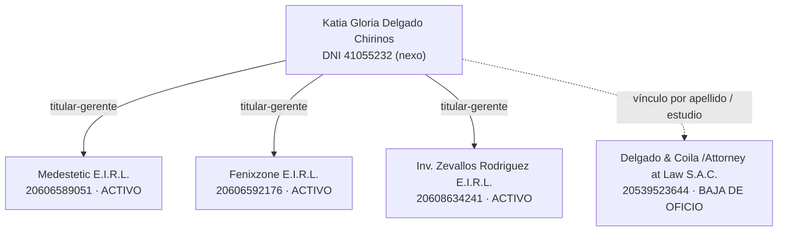

# Dossier de Due Diligence — Grupo empresarial (Arequipa, Perú)

**Fecha de captura:** 2026-06-23  
**Fuentes primarias:** SUNAT (vía api.apis.net.pe/v1/ruc, espejo del padrón SUNAT), datosperu.org (perfil público de empresa), búsqueda web pública (prensa, redes)

> ⚠️ **Descargo:** Documento de inteligencia de fuentes abiertas (OSINT). NO reemplaza un reporte de central de riesgo (Infocorp/Sentinel) ni una verificación registral en SUNARP/SUNAT.

> **Limitación de fuente:** SUNAT e-consultaruc bloquea el acceso automatizado desde IP de datacenter mediante WAF ('Request Rejected'); se usa la API espejo de SUNAT (apis.net.pe) y datosperu.org como fuentes públicas equivalentes. Registrado como 'requiere acceso' para verificación manual.

## Resumen ejecutivo

Se investigaron 4 empresas peruanas vinculadas y 1 persona nexo. Las tres **E.I.R.L.** (Medestetic, Fenixzone, Inversiones Zevallos Rodriguez) están **ACTIVAS y HABIDAS**, domiciliadas en Arequipa y comparten a la misma **titular-gerente: KATIA GLORIA DELGADO CHIRINOS (DNI 41055232)**. La cuarta, el estudio jurídico **DELGADO & COILA /ATTORNEY AT LAW S.A.C.**, figura en **BAJA DE OFICIO** ante SUNAT. El hallazgo de mayor materialidad es la cobertura de prensa (abril 2025) sobre la **muerte de una paciente tras una cirugía en Medestetic**, local **clausurado y multado por la Municipalidad de Yanahuara por operar sin licencia para cirugías**, con **investigación fiscal por homicidio culposo** en curso contra el cirujano y su equipo.

## Fichas por empresa

### CORPORACION MEDICA MEDESTETIC E.I.R.L.

- **RUC:** 20606589051
- **Nombre comercial:** Bodytite Arequipa / centro Bodytite (marca con la que opera públicamente)
- **Tipo de contribuyente:** EMPRESA INDIVIDUAL DE RESP. LTDA
- **Estado del RUC:** ACTIVO
- **Condición de domicilio:** HABIDO
- **Fecha de inscripción:** 27 de setiembre de 2020
- **Inicio de actividades:** 21 de octubre de 2020
- **Régimen tributario:** no disponible públicamente
- **Trabajadores (estimado público):** 5 (periodo 2025-11, fuente datosperu/SUNAT)

**Actividad económica (CIIU)**  
**Principal:** 8610 - ACTIVIDADES DE HOSPITALES  
**Secundarias:** 8620 - ACTIVIDADES DE MÉDICOS Y ODONTÓLOGOS

**Domicilio fiscal**  
AV. CORONEL FRANCISCO BOLOGNESI NRO. 456B URB. LAS RETAMAS  
Distrito: YANAHUARA · Provincia: AREQUIPA · Departamento: AREQUIPA · Ubigeo: 040126

**Establecimientos anexos:** requiere acceso: la ficha extendida de SUNAT (anexos) bloquea el acceso automatizado por WAF

**Gobernanza / Representantes**

| Nombre | DNI | Cargo | Vigencia |
|---|---|---|---|
| DELGADO CHIRINOS KATIA GLORIA | 41055232 | TITULAR-GERENTE | desde 24 DE SETIEMBRE DE 2020 |

**Vínculos**
- FENIXZONE E.I.R.L (RUC 20606592176) — representante en común: DELGADO CHIRINOS KATIA GLORIA
- INVERSIONES ZEVALLOS RODRIGUEZ E.I.R.L. (RUC 20608634241) — representante en común: DELGADO CHIRINOS KATIA GLORIA
- DELGADO CHIRINOS KATIA GLORIA (DNI 41055232) — persona nexo (titular-gerente)

**Riesgo público**
- No habido: No
- Deuda en cobranza coactiva: Sin deuda coactiva > 1 UIT declarada en programas Reactiva/COVID (flags: NO, NO). Estado coactivo general SUNAT: requiere acceso (consulta de deuda coactiva exige captcha en SUNAT).
- **Investigación fiscal / cobertura de prensa** (abril de 2025): Medestetic, donde falleció policía por cirugía plástica, no tenía licencia para operar — Una suboficial de la PNP (Diviac), Yuliana Wendy Huamaní Benavidez (28), falleció tras una cirugía estética realizada el 3-4 de abril de 2025 en el centro ubicado en Av. Bolognesi 456-B, Yanahuara (misma dirección que el domicilio fiscal del RUC). La Municipalidad de Yanahuara determinó que el local solo tenía licencia para consultorio médico, no para cirugías; dispuso la clausura y una multa de 1 UIT (~S/ 5,350).
  - Estado: Reportado por prensa; expediente formal en Poder Judicial (CEJ) requiere acceso (captcha).
  - Fuentes: https://rpp.pe/peru/arequipa/arequipa-inician-investigacion-preliminar-por-muerte-de-suboficial-tras-someterse-a-cirugia-estetica-noticia-1627047 · https://www.apnoticias.pe/peru/el-buho/arequipa-medestetic-donde-fallecio-policia-por-cirugia-plastica-no-tenia-licencia-para-operar-1414638 · https://inforegion.pe/arequipa-medestetic-donde-hicieron-cirugia-plastica-a-policia-que-fallecio-no-tenia-licencia-para-operar/
- **Investigación fiscal / cobertura de prensa** (abril de 2025): Fiscalía investiga a cirujano y equipo de Corporación Médica Medestetic por homicidio culposo — El Ministerio Público inició investigación preliminar por presunto homicidio culposo (negligencia médica) contra el cirujano Ronner Ruiz y su equipo. Un medio (pancarta.pe) reportó que el médico investigado se encontraba prófugo/inubicable.
  - Estado: Reportado por prensa; expediente formal en Poder Judicial (CEJ) requiere acceso (captcha).
  - Fuentes: https://rpp.pe/peru/arequipa/arequipa-inician-investigacion-preliminar-por-muerte-de-suboficial-tras-someterse-a-cirugia-estetica-noticia-1627047 · https://www.pancarta.pe/notas-imprescindibles/arequipa/medico-profugo-muerte-cirugia-estetica/
- **Sanción (Municipalidad Distrital de Yanahuara):** Clausura del local + multa 1 UIT (~S/ 5,350) — Realizar cirugías con licencia solo de consultorio médico (sin licencia para cirugías). (abril de 2025). Fuente: https://rpp.pe/peru/arequipa/arequipa-inician-investigacion-preliminar-por-muerte-de-suboficial-tras-someterse-a-cirugia-estetica-noticia-1627047
- Sanciones INDECOPI: Búsqueda en registro INDECOPI: requiere acceso (formulario con captcha).
- Protestos: no disponible públicamente

**Contratación estatal (OSCE/SEACE)**  
Sin contrataciones con el Estado registradas en el perfil agregado de datosperu. Verificación directa en OSCE/SEACE-CONOSCE: requiere acceso (portal bloquea acceso automatizado).

**Huella digital y reputación**
- Web: no disponible públicamente (sin sitio web propio verificado)
- Redes: Facebook: Bodytite Arequipa (https://www.facebook.com/corporacionmedicaarequipa/); Instagram: @bodytite_arequipa (https://www.instagram.com/bodytite_arequipa)
- Google rating: no disponible públicamente (Google Places requiere API key/clave)
- Google reseñas: no disponible públicamente
- Ranking datosperu: 129044

**Fuentes**
- RUC, razón social, estado, condición, dirección, ubigeo, distrito/prov/depto — _SUNAT (vía api.apis.net.pe/v1/ruc, espejo del padrón SUNAT)_ (2026-06-23)
- Tipo contribuyente, fechas inscripción/inicio, CIIU, comprobantes, representantes, trabajadores, coactiva — _datosperu.org (perfil público de empresa)_ (2026-06-23)
- Riesgo reputacional/legal (prensa) — _https://rpp.pe/peru/arequipa/arequipa-inician-investigacion-preliminar-por-muerte-de-suboficial-tras-someterse-a-cirugia-estetica-noticia-1627047_ (2026-06-23)
- Riesgo reputacional/legal (prensa) — _https://rpp.pe/peru/arequipa/arequipa-inician-investigacion-preliminar-por-muerte-de-suboficial-tras-someterse-a-cirugia-estetica-noticia-1627047_ (2026-06-23)

---

### FENIXZONE E.I.R.L

- **RUC:** 20606592176
- **Nombre comercial:** no disponible públicamente
- **Tipo de contribuyente:** EMPRESA INDIVIDUAL DE RESP. LTDA
- **Estado del RUC:** ACTIVO
- **Condición de domicilio:** HABIDO
- **Fecha de inscripción:** 27 de setiembre de 2020
- **Inicio de actividades:** 11 de octubre de 2020
- **Régimen tributario:** no disponible públicamente
- **Trabajadores (estimado público):** no disponible públicamente

**Actividad económica (CIIU)**  
**Principal:** 4649 - VENTA AL POR MAYOR DE OTROS ENSERES DOMÉSTICOS

**Domicilio fiscal**  
AV. BOLOGNESI NRO. 16 URB. LOS SAUCES DE CAYMA  
Distrito: CAYMA · Provincia: AREQUIPA · Departamento: AREQUIPA · Ubigeo: 040103

**Establecimientos anexos:** requiere acceso: la ficha extendida de SUNAT (anexos) bloquea el acceso automatizado por WAF

**Gobernanza / Representantes**

| Nombre | DNI | Cargo | Vigencia |
|---|---|---|---|
| DELGADO CHIRINOS KATIA GLORIA | 41055232 | TITULAR-GERENTE | desde 21 DE SETIEMBRE DE 2020 |

**Vínculos**
- CORPORACION MEDICA MEDESTETIC E.I.R.L. (RUC 20606589051) — representante en común: DELGADO CHIRINOS KATIA GLORIA
- INVERSIONES ZEVALLOS RODRIGUEZ E.I.R.L. (RUC 20608634241) — representante en común: DELGADO CHIRINOS KATIA GLORIA
- DELGADO CHIRINOS KATIA GLORIA (DNI 41055232) — persona nexo (titular-gerente)

**Riesgo público**
- No habido: No
- Deuda en cobranza coactiva: Sin deuda coactiva > 1 UIT declarada en programas Reactiva/COVID (flags: NO, NO). Estado coactivo general SUNAT: requiere acceso (consulta de deuda coactiva exige captcha en SUNAT).
- Procesos judiciales: no se hallaron en fuentes públicas abiertas (CEJ-Poder Judicial requiere acceso/captcha).
- Sanciones INDECOPI: Búsqueda en registro INDECOPI: requiere acceso (formulario con captcha).
- Protestos: no disponible públicamente

**Contratación estatal (OSCE/SEACE)**  
Sin contrataciones con el Estado registradas en el perfil agregado de datosperu. Verificación directa en OSCE/SEACE-CONOSCE: requiere acceso (portal bloquea acceso automatizado).

**Huella digital y reputación**
- Web: no disponible públicamente
- Redes: no disponible públicamente
- Google rating: no disponible públicamente
- Google reseñas: no disponible públicamente
- Ranking datosperu: no disponible públicamente

**Fuentes**
- RUC, razón social, estado, condición, dirección, ubigeo, distrito/prov/depto — _SUNAT (vía api.apis.net.pe/v1/ruc, espejo del padrón SUNAT)_ (2026-06-23)
- Tipo contribuyente, fechas inscripción/inicio, CIIU, comprobantes, representantes, trabajadores, coactiva — _datosperu.org (perfil público de empresa)_ (2026-06-23)

---

### INVERSIONES ZEVALLOS RODRIGUEZ E.I.R.L.

- **RUC:** 20608634241
- **Nombre comercial:** no disponible públicamente
- **Tipo de contribuyente:** EMPRESA INDIVIDUAL DE RESP. LTDA
- **Estado del RUC:** ACTIVO
- **Condición de domicilio:** HABIDO
- **Fecha de inscripción:** 19 de octubre de 2021
- **Inicio de actividades:** 21 de noviembre de 2021
- **Régimen tributario:** no disponible públicamente
- **Trabajadores (estimado público):** 2 (periodo 2025-11, fuente datosperu/SUNAT)

**Actividad económica (CIIU)**  
**Principal:** 8690 - OTRAS ACTIVIDADES DE ATENCIÓN DE LA SALUD HUMANA

**Domicilio fiscal**  
CAL.MISTI NRO. 203 URB. QUEZADA  
Distrito: YANAHUARA · Provincia: AREQUIPA · Departamento: AREQUIPA · Ubigeo: 040126

**Establecimientos anexos:** requiere acceso: la ficha extendida de SUNAT (anexos) bloquea el acceso automatizado por WAF

**Gobernanza / Representantes**

| Nombre | DNI | Cargo | Vigencia |
|---|---|---|---|
| DELGADO CHIRINOS KATIA GLORIA | 41055232 | TITULAR-GERENTE | desde 12 DE MAYO DE 2022 |

**Vínculos**
- CORPORACION MEDICA MEDESTETIC E.I.R.L. (RUC 20606589051) — representante en común: DELGADO CHIRINOS KATIA GLORIA
- FENIXZONE E.I.R.L (RUC 20606592176) — representante en común: DELGADO CHIRINOS KATIA GLORIA
- DELGADO CHIRINOS KATIA GLORIA (DNI 41055232) — persona nexo (titular-gerente)

**Riesgo público**
- No habido: No
- Deuda en cobranza coactiva: Sin deuda coactiva > 1 UIT declarada en programas Reactiva/COVID (flags: NO, NO). Estado coactivo general SUNAT: requiere acceso (consulta de deuda coactiva exige captcha en SUNAT).
- Procesos judiciales: no se hallaron en fuentes públicas abiertas (CEJ-Poder Judicial requiere acceso/captcha).
- Sanciones INDECOPI: Búsqueda en registro INDECOPI: requiere acceso (formulario con captcha).
- Protestos: no disponible públicamente

**Contratación estatal (OSCE/SEACE)**  
Sin contrataciones con el Estado registradas en el perfil agregado de datosperu. Verificación directa en OSCE/SEACE-CONOSCE: requiere acceso (portal bloquea acceso automatizado).

**Huella digital y reputación**
- Web: no disponible públicamente
- Redes: no disponible públicamente
- Google rating: no disponible públicamente
- Google reseñas: no disponible públicamente
- Ranking datosperu: 216556

**Fuentes**
- RUC, razón social, estado, condición, dirección, ubigeo, distrito/prov/depto — _SUNAT (vía api.apis.net.pe/v1/ruc, espejo del padrón SUNAT)_ (2026-06-23)
- Tipo contribuyente, fechas inscripción/inicio, CIIU, comprobantes, representantes, trabajadores, coactiva — _datosperu.org (perfil público de empresa)_ (2026-06-23)

---

### DELGADO & COILA /ATTORNEY AT LAW S.A.C.

- **RUC:** 20539523644
- **Nombre comercial:** no disponible públicamente
- **Tipo de contribuyente:** SOCIEDAD ANONIMA CERRADA
- **Estado del RUC:** BAJA DE OFICIO
- **Condición de domicilio:** HABIDO
- **Fecha de inscripción:** 9 de julio de 2012
- **Inicio de actividades:** 31 de julio de 2012
- **Régimen tributario:** no disponible públicamente
- **Trabajadores (estimado público):** no disponible públicamente

**Actividad económica (CIIU)**  
**Principal:** 6910 - ACTIVIDADES JURÍDICAS

**Domicilio fiscal**  
CAL.MERCADERES NRO. 406 INT. 220 (TIENDA 220)  
Distrito: AREQUIPA · Provincia: AREQUIPA · Departamento: AREQUIPA · Ubigeo: 040101

**Establecimientos anexos:** requiere acceso: la ficha extendida de SUNAT (anexos) bloquea el acceso automatizado por WAF

**Gobernanza / Representantes**

| Nombre | DNI | Cargo | Vigencia |
|---|---|---|---|
| no disponible públicamente | no disponible públicamente | no disponible públicamente | no disponible públicamente |

**Vínculos**
- Sin vínculos por representante común detectados en fuentes públicas (ver sección de grupo).

**Riesgo público**
- No habido: No
- Deuda en cobranza coactiva: no disponible públicamente (consulta de deuda coactiva SUNAT requiere acceso/captcha)
- Procesos judiciales: no se hallaron en fuentes públicas abiertas (CEJ-Poder Judicial requiere acceso/captcha).
- Sanciones INDECOPI: Búsqueda en registro INDECOPI: requiere acceso (formulario con captcha).
- Protestos: no disponible públicamente

**Contratación estatal (OSCE/SEACE)**  
Sin contrataciones con el Estado registradas en el perfil agregado de datosperu. Verificación directa en OSCE/SEACE-CONOSCE: requiere acceso (portal bloquea acceso automatizado).

**Huella digital y reputación**
- Web: no disponible públicamente (no se halló sitio propio verificable)
- Redes: no disponible públicamente
- Google rating: no disponible públicamente
- Google reseñas: no disponible públicamente
- Ranking datosperu: no disponible públicamente

**Fuentes**
- RUC, razón social, estado, condición, dirección, ubigeo, distrito/prov/depto — _SUNAT (vía api.apis.net.pe/v1/ruc, espejo del padrón SUNAT)_ (2026-06-23)
- Tipo contribuyente, fechas inscripción/inicio, CIIU, comprobantes, representantes, trabajadores, coactiva — _datosperu.org (perfil público de empresa)_ (2026-06-23)

---

## Persona nexo

### DELGADO CHIRINOS KATIA GLORIA (DNI 41055232)
- **Rol:** Representante / titular común a investigar
- **Perfil:** Abogada de profesión. Figura como TITULAR-GERENTE de las 3 EIRL del grupo (Medestetic, Fenixzone, Inversiones Zevallos Rodriguez) y su apellido vincula con el estudio 'Delgado & Coila / Attorney at Law S.A.C.'. Fue candidata en las Elecciones Regionales/Municipales 2022.

| RUC | Razón social | Cargo |
|---|---|---|
| 20606589051 | CORPORACION MEDICA MEDESTETIC E.I.R.L. | TITULAR-GERENTE |
| 20606592176 | FENIXZONE E.I.R.L | TITULAR-GERENTE |
| 20608634241 | INVERSIONES ZEVALLOS RODRIGUEZ E.I.R.L. | TITULAR-GERENTE |
| 20539523644 | DELGADO & COILA /ATTORNEY AT LAW S.A.C. | vínculo por apellido (estudio jurídico); rol societario no confirmado públicamente |

**Fuentes:** https://otorongo.club/2022/candidate/41055232/ · https://peruvotoinformado.com/2022/p/katia-gloria-delgado-chirinos · https://www.datosperu.org/empresa-corporacion-medica-medestetic-eirl-20606589051.php

## Grupo: grafo de vínculos

**Naturaleza del vínculo:** las 3 E.I.R.L. comparten **titular-gerente única** (Katia Gloria Delgado Chirinos), confirmada en datosperu para cada RUC; la persona figura como titular de **3 empresas**. El estudio jurídico S.A.C. se vincula por el **apellido Delgado** y por ser la actividad profesional de la nexo (abogada), pero su rol societario exacto **no está confirmado en fuentes públicas abiertas** (la ficha de representantes de SUNAT requiere acceso). Medestetic e Inversiones Zevallos Rodriguez comparten además **distrito (Yanahuara)**.

## Nota metodológica y trazabilidad

- Todos los crudos (JSON de API y HTML de perfiles/prensa) están en `/raw`.
- SUNAT e-consultaruc bloquea el scraping automatizado por WAF; se usó la API espejo del padrón SUNAT (apis.net.pe) + datosperu.org como equivalentes públicos.
- Campos sin fuente pública verificable se marcan **"no disponible públicamente"**; los que exigen autenticación/captcha se marcan **"requiere acceso"**.
- Datos personales: se limita a registro público mercantil (cargo, vigencia, DNI ya presente en padrones electorales/empresariales públicos).